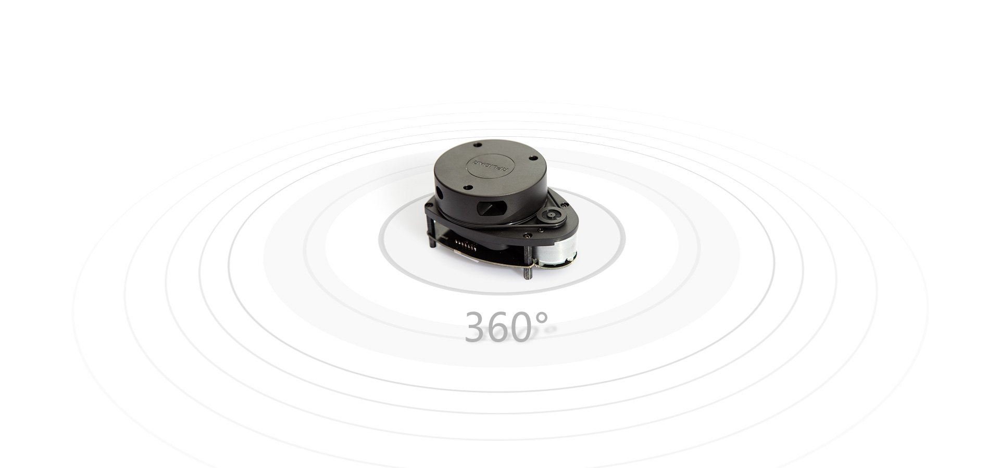
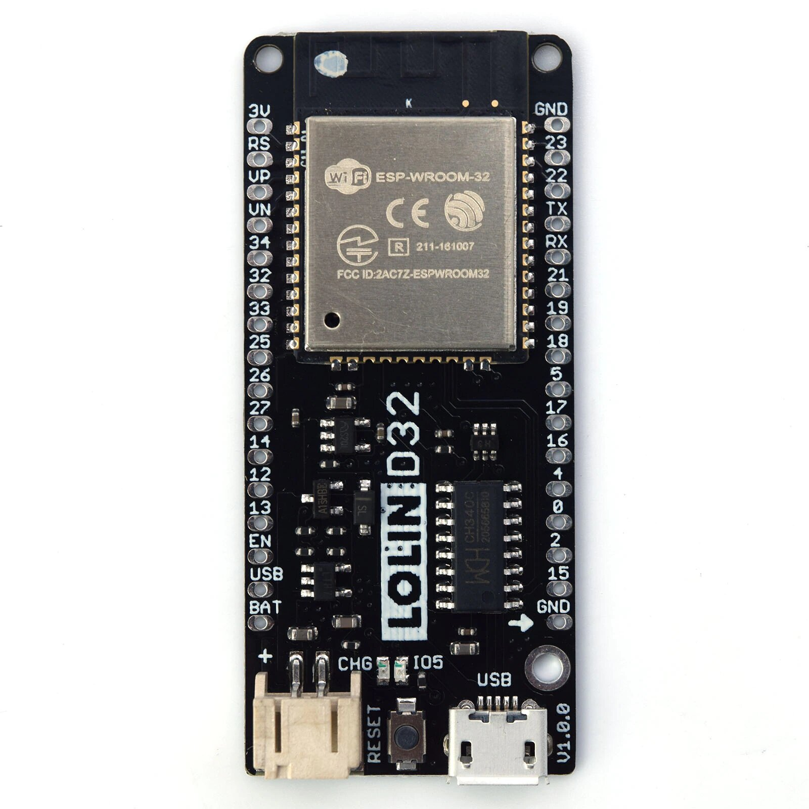
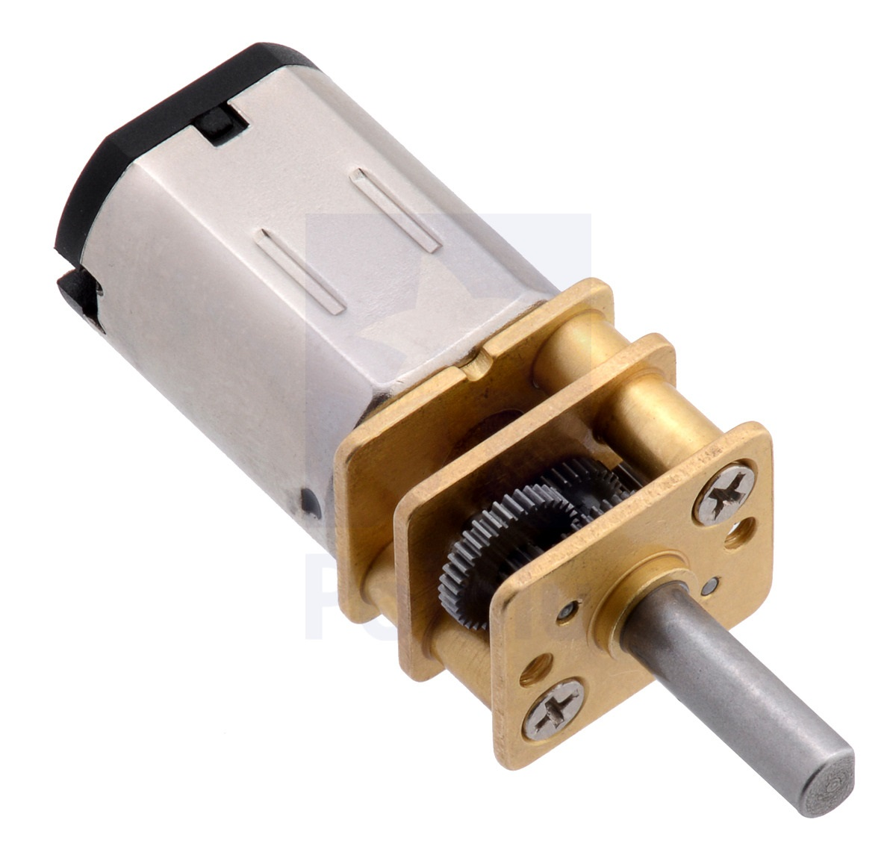

# Violet (Team SHP-2) 

### A robot designed to solve the WRO FutureEngineers task 2021 (Version Mk. IV)

© Anton Ivanchenko, Alexander Shirokovskikh

## [Youtube](https://youtu.be/7AmvBsElHSc)

## Introduction
  We were tasked with designing and assembling an unmanned vehicle that could correctly and accurately accomplish the WRO FutureEngineers 2021 mission. To achieve our goals, we built a four-wheeled robot based on the ESP32. The main sensor of this robot was a lidar system, which gives information about the distances to points around the robot in 360 degrees. During development, geometric features of vehicles, such as Ackermann angles, were taken into account.

## Photo of the robot
  
  
  
  
  
  
  *If it does not open, check the "views" folder, please

## Schematic diagram of an electromechanical device
  
  *If it does not open, check the "\electromechanical component schematic" folder, please

## Repository content
  - The "3D-models" folder contains all versions of 3D models for printing the robot
  - The "final/main" folder contains the final code for the final stage
  - The "qual/main" folder contains the final code for the qualitication stage
  - The "Electromechanical component schematic" folder contains a schematic of the electromechanical representation of the robot
  - The "Team photo" folder contains the team photos required by the regulations
  - The "Views" folder contains overview photos of the robot
  - The "readme_photo" folder contain photo from readme.md

## Assembling the robot
### General Assembly
  Using the Inventor assembly file (3D-models/RRO 2021 Mk.IV/Robot RRO 2021 Mk. IV), you can assemble a working copy of the robot by first printing out all necessary parts and purchasing the necessary components. The robot is assembled with M2 and M3 screws and nuts. Our robot uses ready made components: lidar, ESP32 board, micro metal gearmotor and a removable module with a camera. Also a differential must be installed on the rear axle of the robot. In automobiles and other wheeled vehicles, the differential allows the outer drive wheel to rotate faster than the inner drive wheel during a turn. This is necessary when the vehicle turns, making the wheel that is traveling around the outside of the turning curve roll farther and faster than the other. The average of the rotational speed of the two driving wheels equals the input rotational speed of the drive shaft.

### About lidar
  
  In our robot we use the RPLIDAR A1. It is based on laser triangulation ranging principle and uses high-speed vision acquisition and processing hardware developed by Slamtec. The system measures distance data in more than 8000 times per second. The core of RPLIDAR A1 runs clockwise to perform a 360 degree omnidirectional laser range scanning for its surrounding environment and then generate an outline map for the environment. The sample rate of LIDAR directly decides whether the robot can map quickly and accurately.

### About ESP32
  
  The Lolin D32 development board is based on the Espressif systems ESP32 low power system on a chip microcontroller. It has many powerful features including a dual core Arm based processor, Wi-Fi, Bluetooth, I2C, I2S, SPI, ADC, DAC, and 4MB flash. The D32 module provides these features in a convenient DIP format and can be programmed directly from a USB interface - no additional programming hardware is required. Additionally, the module also includes a charging circuit for a single cell 3.7V lithium battery, meaning that this module can easily be used in remote applications. 

### About Polulu metal gearmotor
  
  This gearmotor is a miniature medium-power, 6 V brushed DC motor with a metal gearbox. It has a cross section of 10 × 12 mm, and the D-shaped gearbox output shaft is 9 mm long and 3 mm in diameter.
  These tiny brushed DC gearmotors are available in a wide range of gear ratios—from 5:1 up to 1000:1—and with five different motors: high-power 6 V and 12 V motors with long-life carbon brushes (HPCB), and high-power (HP), medium power (MP), and low power (LP) 6 V motors with shorter-life precious metal brushes. The 6 V and 12 V HPCB motors offer the same performance at their respective nominal voltages, just with the 12 V motor drawing half the current of the 6 V motor. The 6 V HPCB and 6 V HP motors are identical except for their brushes, which only affect the lifetime of the motor.

### About Camera "TrackingCam"
  Modern mobile robots operate in a predetermined, changing environment, interacting with objects in it. While moving, the robot must assess the environment. For this purpose, we use the "TrackingCam" camera. TrackingCam is a vision module capable of recognizing both single-color objects and composite objects consisting of several color areas. 

## Installing the necessary programs and flashing the board

 - To program the robot you need an Arduino IDE (https://www.arduino.cc/en/software). This open source software allows you to easily write code and upload it to the board.

 - Install ESP32 in the Arduino IDE board manager by adding the link (https://dl.espressif.com/dl/package_esp32_index.json) to the IDE settings.

 - Use the library manager to install the ESP32 library ESP32S2 AnalogWrite.

 - Use the library manager to install the ESP32Servo library.

 - Select the board "WEMOS LOLIN32". Connect the ESP32 board with the microUSB cable to the computer and select the corresponding port in the arduino IDE. Click the "Load" button.

## Starting the robot

 - Turn on the robot with the toggle switch
 - Set up the card as specified in the rules
 - Put the robot on the track
 - Press the button to start