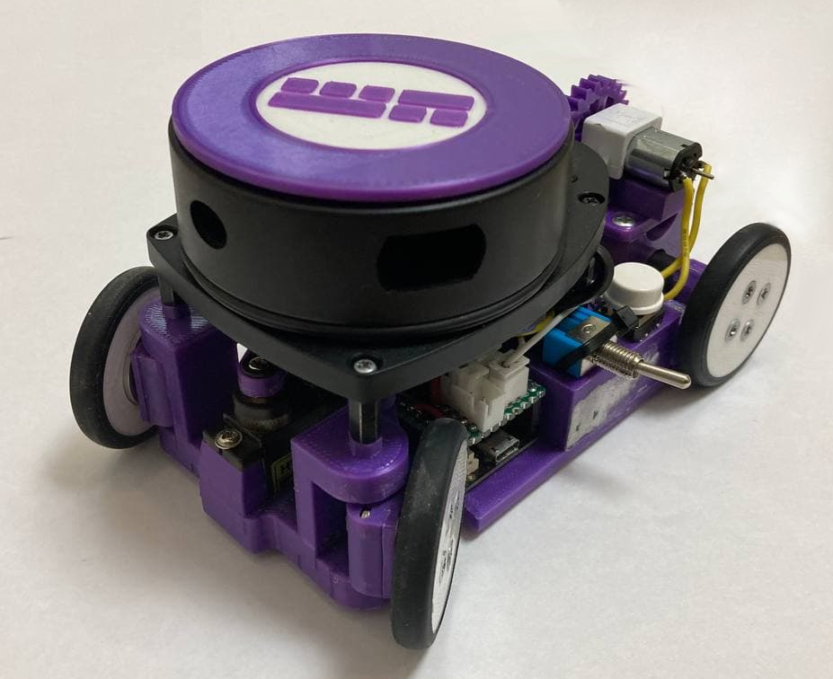
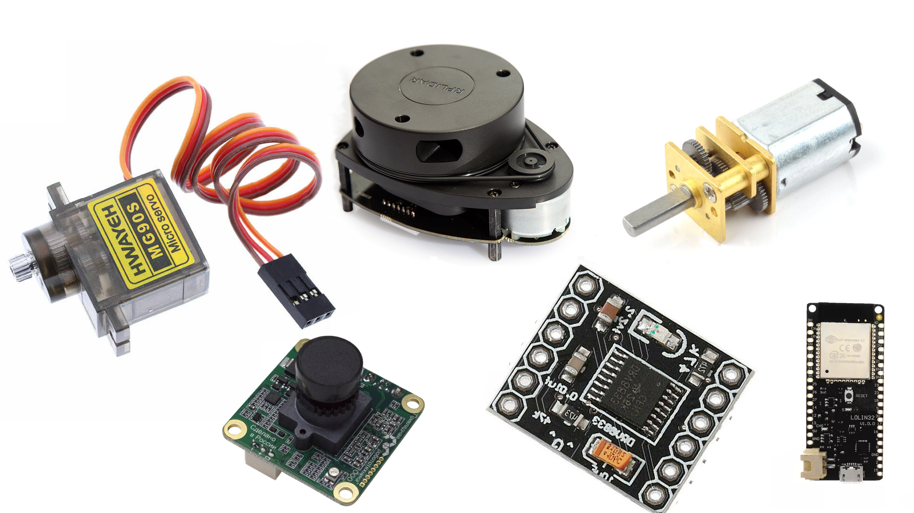

# Violet (Team SHP-2) 

### A robot designed to solve the WRO FutureEngineers 2021 task (Version Mk. IV)
### © Anton Ivanchenko, Alexander Shirokovskikh

 

## Our video review of the robot on [Youtube](https://youtu.be/*)
## Introduction
  We were tasked with designing and assembling an unmanned vehicle that could correctly and accurately accomplish the WRO FutureEngineers 2021 mission. To achieve our goals, we built a four-wheeled robot based on the ESP32. The main sensor of this robot was a lidar system, which gives information about the distances to points around the robot in 360 degrees. During development, geometric features of vehicles, such as Ackermann angles, were taken into account.

## Repository content
  - The "3D-models" folder contains all versions of 3D models for printing the robot
  - The "final/main" folder contains the final code for the final stage
  - The "qual/main" folder contains the final code for the qualitication stage
  - The "electromechanical component schematic" folder contains a schematic of the electromechanical representation of the robot
  - The "Team photo" folder contains the team photos required by the regulations
  - The "Views" folder contains overview photos of the robot
  - The "readme_photo" folder contain photo for readme.md

## Photo of the robot
  
  
  
  
  
  
  *If it does not open, check the "views" folder, please

## Schematic diagram of an electromechanical device
  
  *If it does not open or you need a better quality picture, check the "\electromechanical component schematic" folder, please

## Assembling the robot
### General Assembly
  - First, you need to 3D print all the necessary parts of the robot. To do this, go to the "3D-models/RRO 2021 Mk.IV/Robot RRO 2021 Mk. IV/STL" folder and print on 3D-printer all the models in it.
  - Second, you need to buy all the necessary components: [lidar](https://www.slamtec.com/en/Lidar/A1), [motor](https://www.pololu.com/product/3042), [servo](https://aliexpress.ru/item/1005002235406689.html?spm=a2g0o.search0302.0.0.1f926b66Feapdr&algo_pvid=5aba579a-a3e4-483b-84e7-0390caa93118&algo_expid=5aba579a-a3e4-483b-84e7-0390caa93118-3&btsid=0b8b037016339644962273005e1c0c&ws_ab_test=searchweb0_0,searchweb201602_,searchweb201603_), [motor driver](https://mcustore.ru/store/moduli/drajver-dvigatelya-drv8833/) and [ESP Lolin32 board](https://mcustore.ru/store/espressif-systems/wemos-loin32-sovmestimyj-kontroller-pod-akkumulyator/), as well as the components involved in the robot's circuit board. The robot also requires 4 3x8x3 bearings, 2 3x8x4 bearings, 3x5x4 brass bushings, [differential](https://rc-today.ru/product/differencial-hsp-60065/) and two silicon [pololu tires](https://www.pololu.com/product/3408). To power the robot you can use any 7.4V 2S Li-Po battery included in the dimensions 53x30x11.5mm, for example we use this [battery](https://rc-go.ru/cat/akkumulyator-gensace-lipo-7-4v-2s-25c-450mah/). Two nylon ties and any glue will be needed to attach the button and the switch.  
  - Third, to assemble all the components you will need 12 M3 nuts, 12 M2 nuts, and the following screws (all lengths are from the head of the screw to the end of the thread):
    - 2xM3 7.6mm (countersunk)
    - 2xM3 20.8mm (countersunk)
    - 2xM3 16.25mm (countersunk)
    - 4xM3 16.25mm (countersunk)
    - 16xM3 6.5mm (countersunk)
    - 4xM3 33.8mm
    - 2xM2 7mm
    - 2xM2 8.8mm
    - 8xM2 6,5mm (countersunk)
    - 6xM2 10mm (countersunk)
  - Fourth, according to the schematic, it is necessary to have a slide board not larger than 55.8x25.4 mm. It is recommended to use male and female threaded slats for easy replacement of burned components. The control board should be assembled in the following order: ESP Lolin32, slide board and motor driver.
  - Fifth, assemble all components according to these instructions:
    1. Первое
    2. Второе
    3. Третье

## About our electrical and mechanical components

### Lidar
  We use the RPLIDAR A1 in our robot. It is based on the principle of laser distance triangulation and uses high-speed data acquisition and processing equipment developed by Slamtec. The system measures distance data more than 8,000 times per second. The RPLIDAR A1 core rotates clockwise and performs an omnidirectional 360-degree laser scan of the surrounding space. The resulting data is converted by the MCU to build virtual walls.
  

### ESP32
  The Lolin D32 development board is based on the Espressif systems ESP32 low power system on a chip microcontroller. It has many powerful features including a dual core Arm based processor, Wi-Fi, Bluetooth, I2C, I2S, SPI, ADC, DAC, and 4MB flash. The D32 module provides these features in a convenient DIP format and can be programmed directly from a USB interface - no additional programming hardware is required. Additionally, the module also includes a charging circuit for a single cell 3.7V lithium battery, meaning that this module can easily be used in remote applications. 

### Polulu metal gearmotor
  This gearmotor is a miniature medium-power, 6 V brushed DC motor with a metal gearbox. It has a cross section of 10 × 12 mm, and the D-shaped gearbox output shaft is 9 mm long and 3 mm in diameter.
  These tiny brushed DC gearmotors are available in a wide range of gear ratios—from 5:1 up to 1000:1—and with five different motors: high-power 6 V and 12 V motors with long-life carbon brushes (HPCB), and high-power (HP), medium power (MP), and low power (LP) 6 V motors with shorter-life precious metal brushes. The 6 V and 12 V HPCB motors offer the same performance at their respective nominal voltages, just with the 12 V motor drawing half the current of the 6 V motor. The 6 V HPCB and 6 V HP motors are identical except for their brushes, which only affect the lifetime of the motor.

### Servo MG90S
  The MG90S is a small micro-format servo. So why not use its blue counterparts MG90? The answer is simple - metal gears. Thanks to them, the servo can allow you to exert a lot of force to turn the wheels without any consequences.

## Installing the necessary programs and flashing the board

 - To program the robot you need an Arduino IDE (https://www.arduino.cc/en/software). This open source software allows you to easily write code and upload it to the board. Open exe-file and follow the installer instructions.

 - Install ESP32 in the Arduino IDE board manager by adding the link (https://dl.espressif.com/dl/package_esp32_index.json) to the IDE settings.

 - Use the library manager to install the ESP32 library ESP32S2 AnalogWrite.

 - Use the library manager to install the ESP32Servo library.

 - Select the board "WEMOS LOLIN32". Connect the ESP32 board with the microUSB cable to the computer and select the corresponding port in the arduino IDE. Click the "Load" button.

## Starting the robot

 - Turn on the robot with the toggle switch
 - Set up the card as specified in the rules
 - Put the robot on the track
 - Press the button to start

 ## Our future plans
