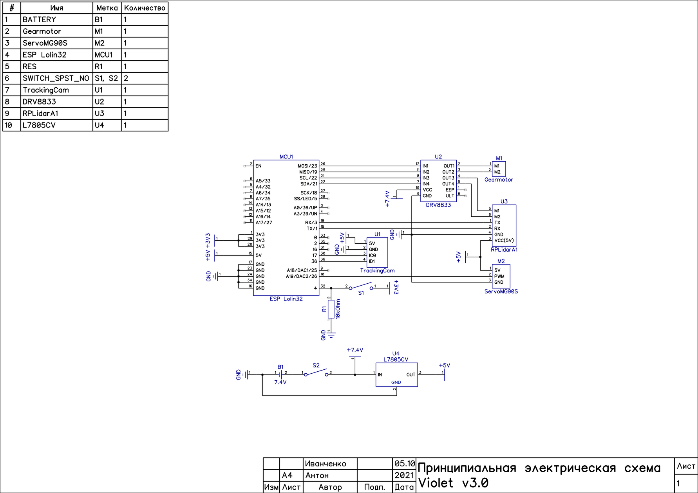

# MicRobot (Команда SHP-7) 

### Робот создан для выполнения задачи РРО "Будущие инженеры" 2022 (Версия Mk. V) 
### © Anton Ivanchenko, Alexander Shirokovskikh, Dmitriy Shmelev

 

## Наш видео-обзор робота на [Youtube](https://youtu.be/UIMAgbEZvwc)
## Вступление
  Перед нами стояла задача спроектировать и собрать беспилотное транспортное средство, которое могло бы верно и точно выполнить задачу РРО "Будущие инжинеры" 2022. Для достижения поставленных целей мы построили четырехколесного робота на базе ESP32. Основным датчиком этого робота стал LIDAR, который дает информацию о расстоянии до препятсвий вокруг робота. При разработке были учтены геометрические особенности транспортных средств, такие как углы Аккермана, дифференциальная передача мощность, а также углы Кастра.

## Содержание репозитория
  - Папка "3D-models" содержит все версии робота
  - Папка "final/main" содержит код финального заезда
  - Папка "qual/main" содержит код для квалификационного заезда
  - Папка "electromechanical component schematic" содержит электромеханическую схему робота
  - Папка "Team photo" содержит два фото команды по регламенту
  - Папка "views" содержит обзорные фото робота с шести сторон
  - Папка "readme_photo" содержит фото, используемые в README.md файле

## Фото робота
  
  
  
  
  
  
  
  *Если фотографии не появляются, пожалуйста, проверьте папку "\views"

## Принципиальная электромеханическая схема
  
  
  *Если фотография не появляется или вам требуется фото лучшего качества, пожалуйста, проверьте папку "\electromechanical component schematic"

## Сборка робота

### General Assembly
  - Во-первых вам понадобится 3д принтер чтобы напечатать все необходимые детали робота. Все необходимые для печати файлы находятся в "3D-models/MicRobot/STL".
  - Во-вторых ва необходимо купить следующие компоненты: [lidar](https://www.ldrobot.com/product/en/98), [мотор](https://www.pololu.com/product/3042), [сервомашинка](https://aliexpress.ru/item/33005962141.html?spm=a2g2w.productlist.i3.1.28112b04bPPZ4H&sku_id=67040694994), [motor driver](https://mcustore.ru/store/moduli/drajver-dvigatelya-drv8833/) и [ESP Lolin32 board](https://mcustore.ru/store/espressif-systems/wemos-loin32-sovmestimyj-kontroller-pod-akkumulyator/), также компоненты для печатной платы робота. Также для робота 8 латунных втулок 3x6x3.5, 8 латунных втулок 2x5x4, [дифференциал](https://aliexpress.ru/item/1005002059526808.html?spm=a2g0s.8937460.0.0.284e2e0es78X7M&_ga=2.115270855.1386300494.1637997466-1501504413.1636710174&_gac=1.229369582.1636715332.CjwKCAiAvriMBhAuEiwA8Cs5lXXNDe5P8AZSbcxNE6eIKPbjUcXarfGioelwyVRt6oiXFh2pakuwRRoCbmgQAvD_BwE) и четыре [колеса](https://www.pololu.com/product/3408). Для питания робота можно использовать любой 7.4V 2S Li-Po аккумулятор размерами до 53x30x11.5мм, например мы используем такой [аккумулятор](https://rc-go.ru/cat/akkumulyator-gensace-lipo-7-4v-2s-25c-450mah/). Также для сборки некоторых элементов робота понпдобится цианакрилатный клей.
  - В-третьих, для сборки напечатаных и купленных компонентов понадобится 10 гаек м2 и следующие винты:
    - 12xM2 10mm (потайные)
    - 2xM2 20mm
    - 2xM2 5mm
    - 4xM3 6mm
  - В-четвёртых, вам необходимо иметь навесную плату размером размером не более 55,8х25,4 мм. Также рекомендуется использовать разъёмы, а не пайку для соединения внешних элементов с платой. Плата управления должна быть собрана в следуюющем порядке:  ESP Lolin32, навесная плата, драйвер двигателя.
  
  - В-пятых, откройте файл сборки "3D-models/MicRobot/rro.step" или "3D-models/MicRobot/rro.f3d", эти файлы можно открыть с помощью Fusion360 или других САПР.

## Про электронные и механические элементы, которые мы используем в роботе

### Лидар
  Мы используем LDRobot LD 06 в нашем роботе. Он основан на принципе лазерной триангуляции расстояния и использует высокоскоростное оборудование для сбора и обработки данных, разработанное LDRobot. Система измеряет данные о расстоянии до 12 метров более 4500 раз в секунду. Ядро LDRobot LD 06 вращается по часовой стрелке и выполняет всенаправленное 360-градусное лазерное сканирование окружающего пространства. Полученные данные преобразуются MCU для построения виртуальных стен.
  

### ESP32
  Отладочная плата Lolin D32 основана на системе малой мощности Espressif systems ESP32 на микроконтроллере. Он обладает множеством мощных функций, включая двухъядерный процессор на базе Arm, Wi-Fi, Bluetooth, I2C, I2S, SPI, ADC, DAC и  4 МБ флэш-памятьи. Модуль D32 предоставляет эти функции в удобном DIP-формате и может быть запрограммирован непосредственно через интерфейс USB — дополнительное оборудование для программирования не требуется. Кроме того, модуль также включает в себя схему зарядки для одноэлементной литиевой батареи 3,7 В, что означает, что этот модуль можно легко использовать в удаленных приложениях.

### DRV8833
  The DRV8833 driver is used to control the motors, which allows to control two collector motors simultaneously. Internally the driver chip contains two independent H-bridges designed for voltages from 2.7 to 10.8 V, with operating current of each channel up to 0.5 A without heat sink, or up to 1.5 A with heat sink mounted on the chip.

### Мотор-редуктор
  Этот мотор-редуктор представляет собой миниатюрный коллекторный двигатель постоянного тока 12 В средней мощности с металлическим редуктором. Он имеет сечение 10×24 мм, а D-образный выходной вал редуктора имеет длину 9 мм и диаметр 3 мм. Эти крошечные щеточные мотор-редукторы постоянного тока доступны с широким диапазоном передаточных чисел — от 5:1 до 1000:1 — и с пятью различными двигателями: двигатели высокой мощности 6 В и 12 В с долговечными угольными щетками (HPCB), и двигатели большой мощности (HP), средней мощности (MP) и малой мощности (LP) 6 В со щетками из драгоценных металлов с более коротким сроком службы. Двигатели HPCB на 6 В и 12 В обеспечивают одинаковые характеристики при соответствующих номинальных напряжениях, только двигатель на 12 В потребляет вдвое меньше тока, чем двигатель на 6 В. Двигатели 6 В HPCB и 6 В HP идентичны, за исключением их щеток, которые влияют только на срок службы двигателя

### Сервомашинка SMG90
SMG90S — это небольшой сервопривод микроформата. Так почему бы не использовать его синие аналоги SG90? Ответ прост - металлические шестерни. Благодаря им сервопривод позволяет прикладывать большое усилие для поворота колес без каких-либо последствий. Благодаря сервоприводу робот может довольно точно устанавливать угол поворота колес.

## Установка необходимых программ и прошивка платы

  - Для программирования робота вам понадобится Arduino IDE ( https://www.arduino.cc/en/software ). Это программное обеспечение с открытым исходным кодом позволяет вам легко писать код и загружать его на доску. Откройте exe-файл и следуйте инструкциям установщика.

  - Установите ESP32 в диспетчере плат Arduino IDE, добавив ссылку ( https://dl.espressif.com/dl/package_esp32_index.json ) в настройки IDE.
    - Сначала добавьте дополнительные ссылки менеджера досок.
    
    
    - После установите модель платы.
    
    
 - Используйте менеджер библиотек для установки библиотеки ESP32.
  
  
  - ESP32S2 AnalogWrite
  
  - И библиотека ESP32Servo.
  
  
- Выберите доску "WEMOS LOLIN32". Подключите плату ESP32 кабелем microUSB к компьютеру и выберите соответствующий порт в arduino IDE. Нажмите кнопку «Загрузить».
  

## Запуск робота

 - Включите робота тумблером
 - Настройте карту, как указано в правилах
 - Поставить робота на трассу
 - Нажмите кнопку, чтобы начать

 ## Наши планы на будущее

  Как всегда на все не хватает времени и денег. И идеи появляются часто. Именно поэтому мы создали этот раздел с нашими планами. Благодаря сервоприводу робот может довольно точно устанавливать угол наклона колес.

  - ### Замена платы, созданной на макетной плате, на плату, созданную на заводе.
   Для этой идеи мы немного изменили принципиальную схему робота, а также создали макет самой платы. Остается только дождаться готовой платы с завода и протестировать ее.

    
  
  - ### Создание обтекаемого кузова
    Эта идея пришла, когда нам нужно было ускорить робота. В итоге мы не стали воспринимать его как очень сложный вариант и оставили на будущее, но обтекаемая форма робота дает плюсы к устойчивости, что является приоритетом.

    

  - ### Уменшение размеров робота
    От регионального этапа к всероссийскому этапу размер робота уменьшился почти в три раза. Но мы уверены, что это не предел и можно сократить конструкцию. Небольшой размер робота позволяет не совершать лишних маневров на трассе, что ускоряет время прохождения. Также уменьшение робота уменьшает массу, это уменьшает инерцию, что позволяет проходить повороты на большей скорости.

    
